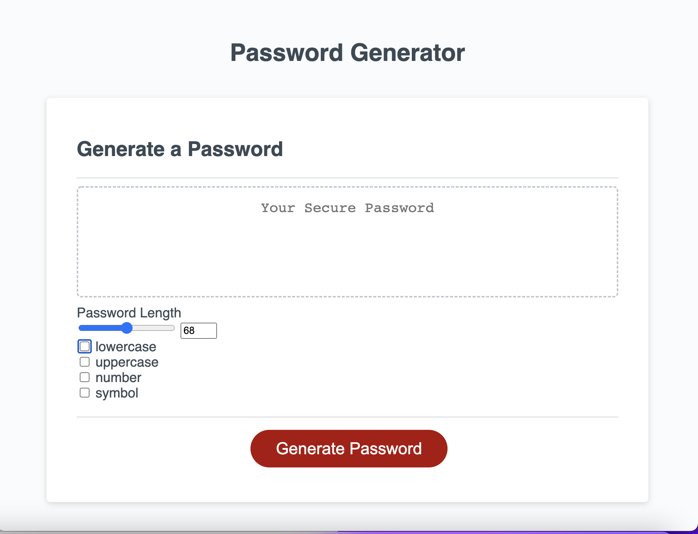

# Password Generator

## Description
Password Generator is software tool that create customized passwords for users. These originators create strong and random passwords for each subscriber account. The most advantaged are individuals who frequently need to create, manage new passwords and want a strong password that provides greater security, especially with access to sensitive data. To include special characters in my Password Generator, I learn from the OWASP Foundation.The facts is, online random generated passwords are better than weak passwords prone to hacking. Passwords are the last defence mechanism from online criminals trying to access our sensitive data. Always aim at making things difficult for them by using strong and unpredictable passwords. Password generators can save you from fraud and other cyber security threats by creating secure and strong paswords.

## Demo

## Link to Website
https://b-smd.github.io/Password-Generator/
https://github.com/B-smd/Password-Generator  
[link](https://www.owasp.org/index.php/Password_special_characters)

## Technologies Used
- JavaScript
- HTML
- CSS

## Usage
This password generation can create 8 to 128 characters long with combination of uppercase characters (A-Z), lowercase characters (a-z), numbers (0-9) and special characters (!#$%&'()*+,-./:;<=>?@[\]^_`{|}~). You can start with a simple paswoord 8 characters long with numbers and go to strong and random password 128 characters long with combination of all the characters and numbers. The message "Please choose at least one of the BOXES!" will appear, if you don't choose any characters. After you choose one or more of the characters the message will disappear.

## Contributing
Pull request are welcome, you can make a constribution at the bottom of any  docs page to make small changes such as a typo, sentence fix or a broken link. For major changes, please open an issue first to discuss what you would like to change.

## Licence
[MIT]
(https)://choosealicence.com/licences/mit/)

